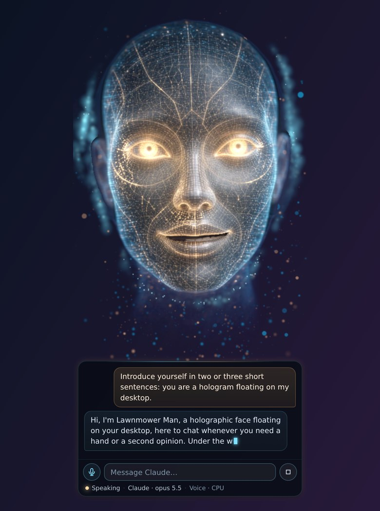
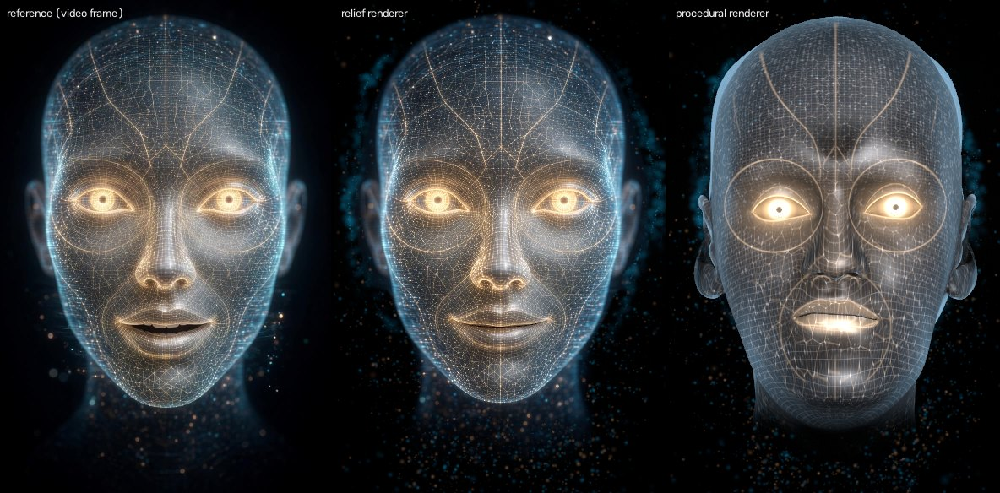
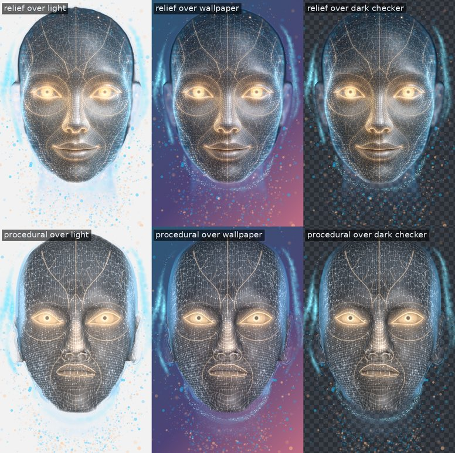

# Lawnmower Man

A holographic desktop avatar for Claude. A glowing wireframe head floats on your desktop, listens, thinks and talks back, with lip-sync, blinks and eyes that follow your cursor.

<p align="center"></p>

<p align="center"><em>The real app (relief renderer) mid-reply, captured from Electron with its transparent window composited over a dark desktop.</em></p>

* **Brain:** your locally installed [Claude CLI](https://docs.claude.com/en/docs/claude-code). The app runs one persistent `claude -p` session over stream-json and uses your existing login; no API key is needed.
* **Face:** a real-time WebGL hologram on your GPU, built from the frames of the reference video (`docs/reference/`).
* **Voice:** runs locally on an NVIDIA GPU. Speech to text is [faster-whisper](https://github.com/SYSTRAN/faster-whisper) (`large-v3-turbo`); text to speech is [Kokoro-82M](https://huggingface.co/hexgrad/Kokoro-82M). Both are tuned for an **RTX 5070 Laptop GPU (8 GB, Blackwell)** and fall back to the CPU automatically.
* **Eyes (optional):** your webcam. Turned on, the avatar makes eye contact, notices when you come and go and smiles back, with face tracking that runs on your PC; Claude sees a picture only when you let it. Off by default ([docs/CAMERA.md](docs/CAMERA.md)).



*Left: a frame of the reference video. Middle: the default "relief" renderer, live and fully rigged. Right: the alternative fully 3D "procedural" renderer.*

---

## Install (testers)

For Windows 11 (10 works too). No Node, git or Python needed; no admin rights.

1. **Download** `Lawnmower-Man-Setup-<version>.exe` from the [Releases page](https://github.com/gkchkump-commits/Lawnmower_Man/releases) (test builds are marked *Pre-release*; `SHA256SUMS.txt` lists the checksums). Rather not install anything? `Lawnmower-Man-<version>-portable.exe` runs as is.
2. **SmartScreen:** the build is not code-signed, so Windows says *"Windows protected your PC"*. Click **More info → Run anyway**. (Your browser may also ask whether to keep the download.)
3. **Install:** the installer is for your user only. Pick a folder or keep the default (`%LOCALAPPDATA%\Programs\Lawnmower Man`); it adds Desktop and Start-menu shortcuts and starts the app at the end.
4. **Claude CLI (required).** Lawnmower Man is a face for *your own* [Claude Code](https://code.claude.com/docs/en/setup) CLI, which needs a Pro, Max, Team, Enterprise or Console account. If the CLI is missing or not signed in, the app shows a card with the steps and Copy buttons:
   ```powershell
   irm https://claude.ai/install.ps1 | iex     # in PowerShell: the official installer (or: winget install Anthropic.ClaudeCode)
   claude                                      # in a NEW terminal window: sign in once, then type /exit
   ```
   Then press **Retry** on the card; no restart needed. The app never runs these commands for you.
5. **Voice:** replies are spoken with a Windows voice right away (choose one under *Settings › Voice*). For voice input and the natural Kokoro voice, choose **Set up local voice…** in the tray menu (or in the settings drawer's Voice section). A PowerShell window opens and installs faster-whisper and Kokoro into `%LOCALAPPDATA%\LawnmowerMan\voice` (about 2–4 GB with models; an NVIDIA GPU is used when there is one, otherwise the smaller CPU version is installed). It needs Python 3.12 and offers to install it with `winget` if it is missing. When the window says *Done*, the app starts the local voice by itself. If the setup fails, *Settings › Voice* shows the last lines of the step that failed, with **Open setup log** and **Copy** buttons; the full log is `%LOCALAPPDATA%\LawnmowerMan\voice\setup.log` (see [docs/VOICE.md](docs/VOICE.md#51-when-the-setup-fails)).
6. **Update:** run the newer `Lawnmower-Man-Setup-<version>.exe` over the installed one (it closes a running Lawnmower Man first). Your settings and the local voice are kept, so there is normally no need to set the voice up again (if the voice reports an error after an update, choose *Set up local voice again…* in the tray menu: it reuses what is already installed).
7. **Uninstall:** Windows *Settings → Apps → Installed apps → Lawnmower Man → Uninstall*. The uninstaller asks whether to also delete your data (default: **No**): the local voice (`%LOCALAPPDATA%\LawnmowerMan\voice`, several GB) and the settings and logs (`%APPDATA%\Lawnmower Man`). A silent uninstall (`/S`) keeps both. It never touches Claude's work folder (`%USERPROFILE%\LawnmowerMan`), your Claude CLI or its login (`%USERPROFILE%\.claude`); remove the CLI separately if you want to.

Reporting a problem? The tray menu's *Open logs folder* has `main.log`; for a failed voice setup, also send `%LOCALAPPDATA%\LawnmowerMan\voice\setup.log` (*Settings › Voice*, **Open setup log**). On laptops with two GPUs, see the hybrid-graphics tip below.

## Requirements (development)

| | |
|---|---|
| OS | Windows 11 (primary target) or Linux (x64) |
| Node.js | 22.12 or newer |
| Claude CLI | installed and logged in: run `claude` once in a terminal and complete the login |
| GPU | any WebGL2 GPU for the avatar. For local voice on the GPU: an NVIDIA driver **R570+** (R580+ for GPU text to speech) |
| Python | 3.12 (only for local voice; 3.11 also works) |

## Quick start (from source)

```powershell
git clone https://github.com/gkchkump-commits/Lawnmower_Man.git
cd Lawnmower_Man
npm install          # also downloads the Electron runtime
npm start            # builds the renderer and launches the avatar
```

The avatar appears in a transparent, always-on-top window. Type in the chat panel to talk to Claude. Replies are spoken with your system's built-in voices until you install local voice:

```powershell
# Windows: GPU voice (about 1.8 GB of CUDA wheels + 2 GB of models; no admin, no CUDA Toolkit)
powershell -ExecutionPolicy Bypass -File scripts\setup-voice.ps1
# or double-click scripts\setup-voice.cmd;  add -Cpu for a machine without an NVIDIA GPU
```

```bash
# Linux
scripts/setup-voice.sh          # add --cpu for CPU only
```

Then choose **Restart voice** in the tray menu, or restart the app. [docs/VOICE.md](docs/VOICE.md) covers the GPU stack, the VRAM budget and troubleshooting.

> **Laptop with hybrid graphics?** The app asks Windows for the high-performance GPU. If the avatar still runs on the integrated GPU, open *Settings → System → Display → Graphics*, add Lawnmower Man (or `electron.exe` in dev) and choose **High performance**.

## Using it

| Input | Action |
|---|---|
| Type + **Enter** | send a message (Shift+Enter: new line, ↑: recall) |
| hold **Space** (outside a text field) | push-to-talk; release to send |
| mic button | click: listen until you stop talking; hold: push-to-talk |
| camera button (toolbar) | turn the camera on/off; while it runs, a **● camera** light shows in the top-left corner |
| camera button (message box) | attach a snapshot of you to the next message (only while the camera is on) |
| **Ctrl+Shift+Space** (global; Linux/macOS: Ctrl+Alt+Space) | talk / interrupt |
| **Ctrl+Shift+F10** (global; Linux/macOS: Ctrl+Alt+X) | stop speaking |
| **Ctrl+Shift+F9** (global; Linux/macOS: Ctrl+Alt+C) | show/hide the chat panel |
| **Esc** | cancel listening, stop speaking, or stop the reply |
| drag the head (or the chat's status bar) | move the window; it settles fully on the screen you drop it on (sized to fit that screen) and remembers the place |
| **Ctrl + mouse wheel** over the head | bigger / smaller (small, medium, large) |
| tray icon | show/hide, always on top, click-through, lock / reset position, camera, Claude mode, new conversation, restart voice, set up local voice, logs, quit |

Hotkeys, window size (small/medium/large), click-through, renderer, voice, speed, hands-free mode, the camera and the Claude settings are all in the **settings drawer** (gear icon). With click-through on, clicks on the transparent parts of the window go to the desktop underneath. *Settings → Window → Lock position* stops accidental moves; *Reset position* puts the avatar back in the bottom-right corner. The eyes follow the mouse anywhere on the desktop (*Settings → Avatar → Eyes follow the cursor*).

Windows avoids Ctrl+Alt global shortcuts: Windows reports AltGr as Ctrl+Alt, so they would swallow AltGr characters such as Polish ć/ź. Settings from an older version that still hold the Ctrl+Alt defaults are moved to the new ones once; shortcuts you chose yourself are kept.

### The camera

Off by default. Turn it on with the toolbar's camera button, *Settings › Camera* or the tray's **Camera** item; the first time, a card explains it before anything is opened. Then the avatar:

* makes **eye contact** (a moving cursor still wins for a moment),
* **dozes off** when you have been away for 2 minutes and **wakes up** with a smile when you are back,
* **smiles back** when you smile,
* optionally **says hello** when you sit down after 10+ minutes away (*Say hello when I sit down*),
* optionally **listens only while you look at the screen** in hands-free mode (*Listen only when I look*).

Face tracking (Google's MediaPipe Face Landmarker) runs inside the app, offline; no video is recorded or uploaded. **Claude sees you only** when *Settings › Camera › Let Claude see me* is on (a snapshot goes with every message) or when you press the camera button in the message box (the next message only); the chat shows the picture that was sent. The camera is released while the window is hidden or minimized. Details, privacy and troubleshooting: [docs/CAMERA.md](docs/CAMERA.md).

### Claude modes

| Mode | What Claude can do | CLI flags |
|---|---|---|
| **chat** (default) | talk only; no tools, no MCP servers | `--tools "" --system-prompt-file <voice persona>` |
| **assistant** | read files in the work folder, search and fetch the web | `--tools Read,Glob,Grep,WebSearch,WebFetch --allowedTools WebSearch`: reads outside the work folder and every web fetch show an Allow/Deny card |
| **agent** | the full Claude Code tool set | default tools; **every** permission prompt appears as an Allow/Deny card, and the avatar asks out loud |

Nothing is ever approved automatically (in assistant mode only web *searches* and reads inside the work folder run without a card). Approval cards show the exact command or content — shortened requests keep Allow disabled until you open *Show all* — and ignore clicks for a moment after they appear, so a click aimed at the window underneath cannot approve anything. Only your own Claude settings (`~/.claude/settings.json`) are loaded: a work folder's `.claude/settings.json` (hooks, permission rules) is ignored, because `claude -p` shows no trust prompt. Claude works in `~/LawnmowerMan` by default; you can change this under *Settings → Claude → Work folder*. The conversation resumes across restarts (`--resume`); **New conversation** in the tray or panel starts fresh.

## Renderers

* **relief** (default): a 2.5D relief mesh baked from your reference video. It carries the video's own pixels and is rigged from MediaPipe face landmarks: jaw and lip shapes, a lid-wipe blink, gaze, brows, and small head turns. It looks almost identical to the video.
* **procedural**: a true 3D head (derived from the Lee Perry-Smith scan, CC BY 3.0) drawn entirely by shaders in the same style. It turns much further, but it looks less like the reference.

Both share a GPU particle aura (cyan and amber motes, cyan wisps) and bloom, and both output premultiplied alpha, so black is fully transparent on the desktop.

**Lip-sync.** The mouth follows the actual words, with either voice. With the local voice it plays the viseme timeline that comes with the audio; with a Windows (system) voice it works the sounds out from the text and keeps them in step with the voice's word timing. The lips close on *m*, *b* and *p*, the lower lip tucks under the teeth on *f* and *v*, the lips round ahead of *o* and *oo*, the tongue shows on *th* and *l*, and the mouth rests at commas and full stops. While talking, the head nods slightly on stressed words, the brows lift on questions, blinks fall between phrases, and a friendly sentence ends with a small smile.

With the local voice the face also follows the sound itself: the jaw opens with each syllable's loudness (stressed syllables wider), the head and brows follow the pitch of the voice, a falling sentence end settles the head, the avatar takes a breath (nostrils, a slight lift) before speaking on, glances away at the start of some phrases and looks back at you by their end. The jaw swings like a hinge, and the cheeks, the chin and the upper lip move with the mouth. *Settings → Avatar → Expressiveness* sets how much the head, brows and face move while speaking (0 % keeps the head still, 100 % is the default, 200 % is very animated). [docs/RENDERER.md](docs/RENDERER.md#lip-sync) has the details; see also the [visemes](docs/screenshots/mouth_visemes.jpg), a [speech film strip](docs/screenshots/mouth_speech.jpg) and [the face moving with the mouth](docs/screenshots/face_with_mouth.jpg).



More comparisons with the reference video: [expressions](docs/screenshots/compare_expressions.jpg) (blink, speaking, teeth), [animation and states](docs/screenshots/animation_strip.jpg), [head motion](docs/screenshots/head_motion.jpg).

### Make an avatar from your own video

```bash
pip install -r tools/bake/requirements.txt
python tools/bake/bake_avatar.py --video my_head.mp4 --out public/assets/avatars/mine
```

Then set *Settings → Avatar → Pack* to `mine` (it maps to `settings.avatar.pack`). `npm run dev` serves the new pack right away; with `npm start`, restart it so the build copies the pack into `dist/`. The video should show a front-facing face on a dark background with at least one blink; [tools/bake/README.md](tools/bake/README.md) has the details.

## Development

```bash
npm run dev            # Vite dev server + Electron with hot reload
npm test               # unit tests (vitest): Electron main logic, Claude session (fake CLI), app logic, avatar director
npm run test:e2e       # Playwright: the app in Chromium with SwiftShader WebGL and a mock bridge
npm run test:voice     # pytest for the voice server (engines mocked)
npm run lint
npm run dist:win       # Windows installer + portable exe (electron-builder, unsigned) into release/
npm run dist:linux-dir # unpacked Linux build in release/linux-unpacked (quick packaging check)
npm run test:packaged  # scripts/electron-e2e.mjs --packaged; set ELECTRON_PATH to the built/installed app
```

Without Electron, open the app in a browser: `npm run build && npm run preview`, then go to `http://127.0.0.1:4173/index.html?mock=1`. The avatar harness with sliders for every rig control is at `/dev/avatar.html` (see [docs/RENDERER.md](docs/RENDERER.md)).

### Where things are

| Path | What |
|---|---|
| `electron/` | main process: window, tray, hotkeys, `app://` protocol, CSP, settings, Claude CLI session, voice sidecar |
| `src/avatar/` | hologram engine (three.js): stage, animation director, particles, bloom, relief / procedural / placeholder heads |
| `src/app/`, `src/audio/`, `src/speech/`, `src/ui/` | conversation state machine, sentence chunking, lip-sync, mic and VAD, voice client, chat UI |
| `src/vision/` | the camera: capture, face tracking (MediaPipe, in a worker), attention, presence, eye contact, snapshots ([docs/CAMERA.md](docs/CAMERA.md)) |
| `voice/` | Python voice server (FastAPI, faster-whisper, Kokoro) |
| `tools/bake/`, `tools/procedural/`, `tools/visual/` | avatar pack baker, procedural head builder, screenshot and compare tools |
| `docs/ARCHITECTURE.md` | the interface contract between all of the above |
| `.github/workflows/release.yml` | Windows installer build, install + end-to-end test of the installed app, publishing on `v*` tags / GitHub releases |

### Publishing a test build

Every pull request builds the Windows installer, installs it on a GitHub Windows runner and drives the installed app; the tested executables are attached to that run as the `lawnmower-man-windows` artifact. To publish them on the [Releases page](https://github.com/gkchkump-commits/Lawnmower_Man/releases), either:

* on GitHub: **Releases → Draft a new release → Choose a tag →** type `v<version from package.json>` (for example `v0.1.0`) **→ Target:** the branch or commit to ship **→** tick *Set as a pre-release* **→ Publish release**. The workflow then builds, tests and attaches the installer, the portable exe and `SHA256SUMS.txt` (about 5 minutes); or
* push a tag: `git tag v0.1.0 && git push origin v0.1.0`, which creates the pre-release automatically.

The tag must match `version` in `package.json` (the files are named after it): bump the version for the next build.

Settings live in `%APPDATA%\Lawnmower Man\settings.json` (Linux: `~/.config/Lawnmower Man/`). Logs are in its `logs/` folder, reachable from the tray menu's *Open logs folder*.

## Troubleshooting

* **"Install Claude Code" card**: the CLI was not found. Follow the card, make sure `claude --version` works in a *new* terminal, then press **Retry**. Installed somewhere unusual? Set *Settings → Claude → CLI path*.
* **"Sign in to Claude Code" card**: the CLI is not logged in (or the login expired). Run `claude` once in a terminal and sign in, then press **Retry**. The card shows the CLI's own message.
* **No voice input / the mic button is disabled**: local voice isn't installed or running. Choose *Set up local voice…* in the tray menu (or *Restart voice* if it is installed). The tray shows the voice status.
* **"Local voice is not fully installed (missing: uvicorn)"**: an earlier setup stopped halfway. The app does not keep restarting the voice server in that state. Open *Settings › Voice*: the last lines of the failed step (pip's `ERROR: …`) are shown there, and **Open setup log** opens the whole log. Fix what it says (often: network, disk space, or a file locked by another program), then choose *Set up local voice again…*. If it fails again, send `setup.log`.
* **Voice is slow the first time**: on RTX 50-series GPUs, the first Whisper GPU run compiles kernels once (30–90 s). After that it is fast.
* **More voice issues** (driver, "no kernel image", cuDNN, CPU fallback): see [docs/VOICE.md § Troubleshooting](docs/VOICE.md#5-troubleshooting).
* **"The camera is blocked"**: in Windows *Settings › Privacy & security › Camera*, turn on **Camera access** and **Let desktop apps access your camera**, then press **Try again** on the card. "In use": close Teams, Zoom, the Camera app or a video call in the browser. More in [docs/CAMERA.md](docs/CAMERA.md#when-the-camera-does-not-start).

## Credits

Third-party models, assets and libraries are listed in [THIRD_PARTY_NOTICES.md](THIRD_PARTY_NOTICES.md). The procedural head is derived from the Lee Perry-Smith head scan by Infinite-Realities (CC BY 3.0).
