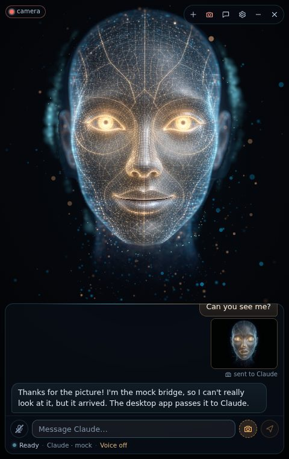

# The camera: the avatar can see you

With the camera on, the hologram makes eye contact, notices when you come and go, smiles back, and,
if you let it, Claude sees a picture of you with your messages. It is **off by default**, and
everything except that picture stays on your PC.



## Turning it on

Any of these:

* the **camera button** in the window's toolbar (top right, appears when you hover the window),
* *Settings › Camera › Camera*,
* the tray menu's **Camera** item.

The first time, a card explains what the camera is used for, and nothing is opened until you press
**Turn on the camera**. While the camera runs, a small **● camera** light shows in the top-left
corner of the avatar (also when the toolbar is hidden); click it to turn the camera off. While
the settings are open, the same light sits in their header.

The camera is released (its light goes off) whenever the window is hidden or minimized, and opened
again when you bring the window back.

## What it does

Each behaviour has its own switch in *Settings › Camera*:

| Setting | Default | What happens |
|---|---|---|
| **Eye contact** (`camera.followFace`) | on | The eyes look at you. A moving mouse cursor still wins for about 1.5 s, then the gaze comes back to you. Contact is broken now and then by a short glance away, like people do. |
| **Notice when I leave** (`camera.presence`) | on | Away for more than 2 minutes while nothing is going on (no reply, no typing or mouse use): the avatar dozes off. When you are back it wakes up with a little eyebrow flash and a smile. While you are in view it does not doze off. |
| **Smile back** (`camera.mirrorExpressions`) | on | When you smile, it smiles back gently. |
| **Let Claude see me** (`camera.shareWithClaude`) | off | Every message you send, typed or spoken, carries one snapshot of you. |
| **Greet me** (`camera.greeting`) | Hello | When the camera first sees you after it is turned on, and when you are back after 2 minutes or more away, the avatar greets you, at most every 5 minutes, never during a reply or while you type. **Hello**: a quick spoken line of its own, right away, with no Claude turn ("Good morning!" by time of day the first time, "Welcome back!" later). **Claude**: the app sends Claude a short hidden note so it says hello in its own words (a second or two); the chat shows a line saying it happened, and the note carries no picture, even with *Let Claude see me* on. **Off**: no greeting. Hiding or minimizing the window does not count as being away. |
| **Listen only when I look** (`camera.lookToTalk`) | off | With *Settings › Voice › Hands-free* on: it only listens while you look at the screen. Speech already in progress is never cut off. |
| **Device** (`camera.deviceId`) | default camera | Which camera to use. If the chosen one is unplugged, the default camera is used. |

### Pictures for Claude

* **Let Claude see me** (above) sends a snapshot with every message.
* The **camera button in the message box** (next to Send) attaches one snapshot to your **next**
  message only, typed or spoken. Press it again to cancel. It only shows while the camera is on.

A snapshot is one JPEG of the moment you send (at most 640 pixels on its longest side, a few tens
of KB). The chat shows it as a thumbnail labelled *sent to Claude*. Claude is told it may receive
webcam snapshots and should react naturally rather than describe them.

## Privacy

* The camera is off until you turn it on, and the first use asks first.
* **Face tracking runs locally**, inside the app, with Google's MediaPipe Face Landmarker. No video
  is recorded, stored or uploaded. It works offline: the model and its runtime are part of the app
  (no download, no CDN). MediaPipe's built-in usage statistics, which it would send to Google once
  a minute, are blocked: the tracker's worker runs under the app's Content-Security-Policy, and the
  main process cancels every network request that does not go to this PC.
* **Claude sees a picture only** when *Let Claude see me* is on or you pressed the camera button
  for one message. The picture goes into that message to your Claude CLI, the same way as your
  text, and from there to Anthropic like the rest of the conversation. The app keeps no copy
  (the thumbnail lives only in the open chat panel), and pictures are never written to its log.
  Like any message, it becomes part of the Claude conversation: Claude Code keeps conversations in
  its own history on your PC (`%USERPROFILE%\.claude\projects`). **New conversation** starts fresh.
* The Electron main process only lets the window use the camera **while the Camera setting is
  on**, and only for the app's own page (`electron/security.js`). Turned off, even a request from
  the page is refused.

## When the camera does not start

The app shows a card that says what to do. The usual causes on Windows:

* **The camera is blocked.** Open the Windows *Settings › Privacy & security › Camera* page and turn on
  **Camera access** and **Let desktop apps access your camera** (Lawnmower Man is a desktop app,
  so it is not listed by name under the Store apps). Then press **Try again**.
* **Another app is using it.** Teams, Zoom, Skype, the Camera app or a browser tab with a video
  call can hold the camera. Close it and press **Try again**.
* **No picture / no camera found.** Many laptops have a privacy shutter or a camera key (often F8
  or F10). An external camera: reconnect it. In Device Manager, check that the camera is enabled.
* **The face is not found** (the light has no cyan ring, *Settings › Camera* says "not in view"):
  make sure your face is lit from the front and roughly 40 to 120 cm from the camera.
* **The eyes look slightly past you**: the camera sits above the screen, so a small offset is
  normal. Turn *Eye contact* off if you prefer the cursor-follow alone.

*Settings › Camera* shows live status: the camera in use, the face tracker (worker or main thread,
detections per second, milliseconds per detection), and whether you are in view and looking.

## How it works

```
CameraCapture ──(<video>, 640×480)──► FaceTracker ──► AttentionTracker ──► behaviours
 getUserMedia      VideoFrame, no copy,  module worker:      present/absent    GazeArbiter → avatar.lookAt
 video only        transferred; one      ~320 px bitmap →    (hysteresis),      PresenceMachine → sleep / wake
                   frame in flight       Face Landmarker     centre, distance,  smile back → avatar.setExpression
                                         (CPU, XNNPACK)      yaw/pitch, look,   greeting → say() / hidden prompt
                                                             smile, talking     look-to-talk → listen gate
snapshot.js ── JPEG ≤ 640 px, q 0.75 ──► controller.sendText ─► claude.send(text, { images })
                                                                 └► main: ipc-validate → ClaudeSession
```

* `src/vision/camera.js` opens the camera (video only, about 640×480 at up to 15 fps) and turns
  `getUserMedia` errors into the cards above.
* `src/vision/face-tracker.js` + `face-worker.js` run the Face Landmarker **off the render loop**
  in a module worker. The main thread only wraps the video's current frame in a `VideoFrame` (a
  reference, about 0.1 ms) and transfers it; the worker scales it to about 320 px and runs the
  landmarker. (`createImageBitmap` on the main thread waits for the GPU process, which took
  100+ ms per frame while the hologram rendered; it is only the fallback without WebCodecs.)
  Measured in the browser preview with software WebGL: the camera's main-thread work is under
  2 ms per second and adds no long tasks. The next frame is sent when the worker has answered, so
  a slow PC just gets fewer detections instead of a queue. Rates: 12 per second while someone is in view, 4 while
  looking for someone, 2 while the avatar sleeps, none while the window is hidden. If a worker
  cannot run it, the landmarker runs on the main thread, capped at 4 per second.
* `src/vision/attention.js` (pure) turns the landmarks and blendshapes into stable signals:
  present after 2 detections over 200 ms, absent after 1.5 s without a face; the face centre
  mirrored like a selfie view; distance from the face width (a typical 65° webcam); head yaw and
  pitch from the face plane; *looking at the screen* when the head is within about 24° sideways
  and from 34° down to 18° up and the eyes are not turned aside; smiling (with hysteresis);
  talking when the jaw keeps opening and closing (a held-open mouth is not speech).
* `src/vision/gaze.js`: eye contact on a flat screen is a gaze straight out of the picture, because
  a face drawn looking out of a picture looks at every viewer in front of it (the "Mona Lisa
  effect"). So the eyes target about (0, 0), lean a little toward where you are (gain 0.35), and
  hold contact for 2.5 to 6.5 s between short glances away. The cursor priority lives here too.
* `src/vision/presence.js` (pure): away 2 min while idle → sleep; back → welcome; the greeting
  rule (the first sight after the camera starts, or back after ≥ 2 min; at most every 5 min).
* `src/vision/index.js` (`CameraFeature`) ties it together and implements every setting;
  `src/vision/ui.js` is its DOM side (buttons, the light, the cards, the info block).
* The WebAssembly runtime of `@mediapipe/tasks-vision` (13 MB) is not committed: the Vite plugin
  `scripts/vite-vision-wasm.mjs` serves it from `node_modules` in development and copies it into
  `dist/assets/vision/wasm/` for the build and the installer. The model
  (`public/assets/vision/face_landmarker.task`, 3.7 MB) is committed. Both load from `app://` and
  work under the app's Content-Security-Policy (`script-src 'self' 'wasm-unsafe-eval'`). A worker
  takes its policy from its own script's response, so `app://` sends the CSP header with scripts
  too (`electron/app-protocol.js`); `@mediapipe/tasks-vision` always starts a usage logger that
  POSTs to `odml.pa.googleapis.com`, and `connect-src` refuses it. Behind that, the session's
  `onBeforeRequest` cancels any http/https/ws request to a host other than 127.0.0.1/localhost
  (`isAllowedRequestUrl` in `electron/security.js`). `scripts/electron-e2e.mjs` checks both.
* Main process: `decidePermission` allows `media` with video only for the app's own origin and only
  while `camera.enabled` is on; `lm:claude:send` validates images (at most 2; JPEG, PNG or WebP
  whose bytes match the type; base64 without a `data:` prefix; ≤ 1.5 MB) before ClaudeSession puts
  them as image content blocks after the text. With `backgroundThrottling` off, the page cannot
  tell that the window is hidden, so main sends `lm:window:visibility`.

## Development and tests

* `npm run dev`, then open `/dev/camera.html`: your camera with the tracker's key points and the
  attention signals live (`?main=1` runs the tracker on the main thread, `?hz=N` sets the rate).
* Unit tests (`tests/unit/vision/`, `tests/unit/app/controller-camera.test.js`,
  `tests/unit/systems/camera-main.test.js`): attention on synthetic landmarker results, presence,
  gaze and cursor priority, snapshot sizing, camera errors, the feature with fakes, the controller,
  settings, permissions, image validation and ClaudeSession image blocks against the fake CLI.
* Playwright (`tests/e2e/camera.spec.js`): Chromium's fake camera plays a frame of the reference
  video (`docs/reference/neutral.jpg`, turned into a Y4M by the test itself). **MediaPipe does
  detect that face** (frontal, looking at the screen), so the test checks the privacy card, the
  light, real face detection in the worker, eye contact, the drawer, and that *Let Claude see me*
  and the camera button deliver a 640×480 JPEG to the mock bridge.
* Electron (`scripts/electron-e2e.mjs`, also `--packaged`): the camera is refused while the setting
  is off; with it on, the privacy card, then face tracking loading its wasm and model over `app://`
  (from `app.asar` when packaged) in a worker; the fake CLI receives and acknowledges an image block.
