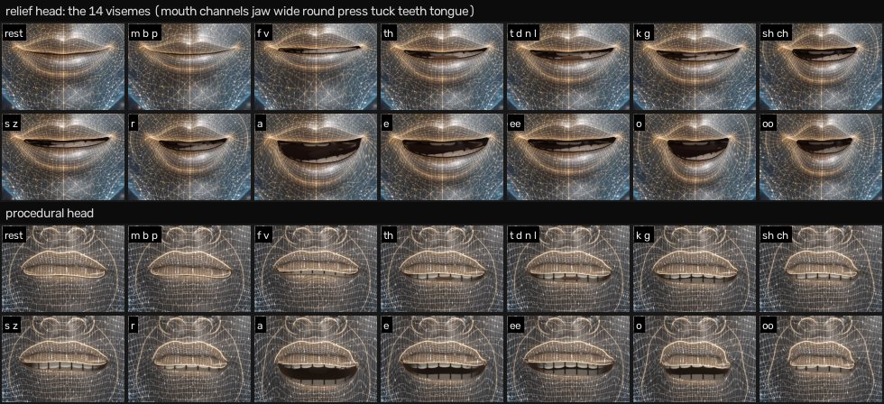
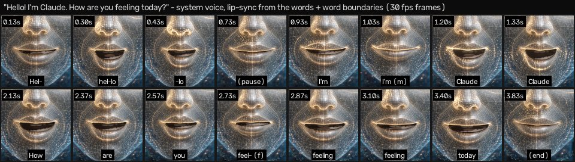

# Renderer app (chat, voice pipeline, UI)

The renderer is everything in the window around the hologram: the conversation state machine,
the speech pipeline, the chat panel and the settings. It talks to the Electron main process only
through `window.lawnmower` (contract §3); in a plain browser it uses a mock of the same API.

```
src/main.js              bootstrap: bridge → settings → speech/audio → UI → avatar → controller
src/bridge/              index.js (real bridge or mock), mock.js, mock-voice.js (in-page fake voice server)
src/app/                 controller.js      conversation state machine (contract §7)
                         sentence-chunker.js streaming text → speakable chunks
                         speech-text.js     Markdown → speech text
                         speech-queue.js    ordered TTS with limited parallel prefetch
                         permission.js      tool-call summaries, spoken prompts and cues
                         click-through.js   setIgnoreMouse decisions with hysteresis
                         gaze.js            cursor position (desktop-wide in Electron) → avatar.lookAt
                         settings-defaults.js renderer copy of the §4 defaults, getPath/patchFor
                         emitter.js         tiny event emitter
src/audio/               player.js (Web Audio queue + dry analyser), voicefx.js (+ voicefx-worklet.js: the
                         voice character on the audio thread), lipsync.js (drivers), articulation.js
                         (coarticulation model, speech plans), g2p.js (text → phonemes), mic.js
                         (+ mic-worklet.js), vad.js, dsp.js (resampler), wav.js
src/speech/              voice-client.js (voice server §6), web-speech.js (browser voice), index.js (tts/stt routing)
src/ui/                  app-view.js, transcript.js, markdown.js, composer.js, permission-cards.js,
                         toasts.js, status.js, settings-drawer.js, accelerator.js, avatar-host.js, layout.js, dom.js
src/styles/app.css       the glass UI
```

## Conversation

`idle → listening → transcribing → thinking → speaking → idle`, mirrored on `body[data-state]`.

* Typed text enters at *thinking*. Sending while Claude is busy pre-empts the current reply
  (speech stops, the turn is interrupted, its partial text stays in the chat).
* Streamed text goes to the transcript (safe Markdown, re-rendered at most once per frame) and,
  when replies are spoken, through the sentence chunker → `toSpeechText` → the speech queue.
  The first chunk may be cut early at a clause (~40 characters) for a fast first sound; code
  blocks and tables are never spoken ("I've put the code in the chat.").
* Speech: the local voice server (Kokoro, with a viseme timeline) when it is running, otherwise
  the system's speech synthesis (Web Speech: the voice chosen in *Settings › Voice*, saved as
  `voice.systemVoice`, or the most natural English one; the list refreshes on `voiceschanged`),
  otherwise text only. Up to two sentences
  are synthesized ahead of the one playing. The local voice plays through the voice character
  (*Settings › Voice › Character*: Synth by default; `src/audio/voicefx.js` in an AudioWorklet, see
  [VOICE.md](VOICE.md#24-voice-character)); the lip-sync analyser taps the dry voice before it.
* Lip-sync each frame (see [Lip-sync](#lip-sync) below) → `avatar.setMouth` (jaw, wide, round,
  press, tuck, teeth, tongue), loudness → `avatar.setSpeechLevel`, prosody cues → `avatar.setProsody`.
* Tool calls show as chips; if Claude goes straight to a tool the avatar says a short cue.
  Permission requests (agent mode) show a card with Allow/Deny and a spoken prompt. Nothing is
  ever approved automatically. Cards disappear when their turn ends or the CLI restarts.
* Voice input needs the local voice server (faster-whisper). Without it the mic button is
  disabled and its tooltip explains how to install it (*Set up local voice…*).
* First run: a missing or logged-out Claude CLI (main's `problem` event) shows a setup card over
  the avatar with the official install commands, Copy buttons and Retry (`src/ui/setup-cards.js`,
  `src/app/setup-help.js`); a voice setup that has to be run by hand shows its command the same way.
* Hands-free (setting): a VAD listens whenever the conversation is idle and pauses while the
  avatar thinks or speaks (half-duplex, so it never hears itself).
* After 10 idle minutes the avatar dozes (`sleep` state); any activity wakes it.

## Lip-sync

Every source ends in the same coarticulation model (`src/audio/articulation.js`): timed segments,
each an articulatory target on seven channels, blended by dominance functions (Cohen & Massaro):
the lips own m/b/p (press) and f/v (tuck), the jaw owns the vowels, rounding spreads ~120 ms ahead
into the consonants before an O / U (unless a spread vowel is in between), an h or a schwa takes
its neighbours' shape, and a closure is dominant enough that a 50 ms "m" still closes (press ≥ 0.8,
jaw ≤ 0.06). A closure passed between two frames is shown, and the director closes the jaw fast
into it, so it also closes on screen at 30 fps.

| Source | Mouth |
|---|---|
| local voice (Kokoro) | the server's viseme timeline at the playback clock + 50 ms visual lead; vowel prominence from duration, the jaw scaled by the measured loudness |
| system voice (Web Speech) | the utterance's words → phonemes (`g2p.js`: a ~500-word exception dictionary incl. "Claude", NRL letter-to-sound rules, stress, numbers, acronyms) → a timed plan (stressed vowels long, closures ≥ 50 ms, phrase-final lengthening, rests at punctuation that ends a word; a mark inside a token — `package.json`, `github.com`, `10:30` — is read straight through, with a spoken "dot" between letters). Word-boundary events (`charIndex`) anchor each word; between them the plan runs at a speed learned from the boundaries (per utterance rate); an early boundary compresses the rest of the word, a late one holds the word's last sound (or waits at rest in a pause). Voices without boundary events play the whole plan from `onstart`, and the next utterance uses the tempo the last one turned out to have. A voice that has not reported its start after 0.6 s is assumed to have started; when its real `onstart` (or first boundary) comes later, the mouth re-anchors there instead of leading the voice, and no tempo is learned from the guess. |
| audio without visemes | RMS → jaw (noise gate), band ratios → spread / round, quiet hiss → teeth |

The plan also yields prosody cues (accents on the stressed syllables of content words, the last one
of a phrase strongest; phrase starts and ends with their punctuation; emphasis; friendliness),
which the director turns into small nods, phrase lifts, a brow raise and head tilt on questions,
blinks at phrase boundaries rather than mid-word, and a micro-smile after a friendly sentence. All
of it is pure and unit-tested (`tests/unit/app/{g2p,articulation,lipsync}.test.js`,
`tests/unit/avatar/{director-speech,mouth-rig}.test.js`).





Rendering: the relief head closes pressed lips over a slightly open jaw and thins them (the lip
texture is compressed toward the seam and the rest gap skipped), brings a tucked lower lip up under
the incisors (which fill the small opening), raises the upper lip for teeth (the incisors follow),
draws a dim tongue tip at the teeth, pulls the corners in for round and out for spread, and tilts
them slightly with `mouthAsym`. The procedural head does the same in its vertex rig and cavity
shader; the placeholder maps wide / round / press onto its mouth line.

Check it in the avatar harness: `/dev/avatar.html?fixedTime=1&vis=PP` (one viseme),
`?fixedTime=1&press=1`, `?fixedTime=1&tuck=1&jaw=0.08`, `?fixedTime=1&tongue=1&jaw=0.2`, and
`/dev/avatar.html?ui=0&caption=1&say=Hello!%20I'm%20Claude.&t=0.9`: a deterministic run of the real
system-voice path at 60 Hz (a scripted voice sends word boundaries at its own tempo with jitter;
`bounds=0` is a voice without boundaries; `rate`, `voiceTempo`, `jitter`, `latency`).
`window.__seek(t)` steps it; `node tools/visual/film.mjs` records the frames for a video
(see tools/visual/README.md).

## Using it

| Input | Action |
|---|---|
| Enter / Shift+Enter | send / new line (↑ recalls the last messages) |
| hold **Space** (focus not in a text field) | push-to-talk; release to send |
| mic button | click: listen until you stop talking (click again to stop); hold: push-to-talk |
| **Esc** | close settings · cancel listening · stop speaking · otherwise stop the reply |
| send button while busy | becomes Stop |
| global hotkeys (Settings › Shortcuts) | talk / interrupt, stop speaking, show/hide chat |
| drag the head (or the status line) | move the window |

The window is the 2:3 avatar area plus, when the chat panel is on, a strip below it. With the
panel off (minimal mode) the panel floats over the avatar while something happens or the pointer
is near, and hides when idle. With click-through on (Windows/macOS), clicks on transparent
pixels reach the desktop; the head, the panel and cards stay clickable.

## Browser preview (no Electron)

`npm run build && npm run preview`, or Vite dev, then open `index.html?mock=1`:

| URL parameter | Effect |
|---|---|
| `mock=1` | use the mock bridge (also automatic when `window.lawnmower` is missing) |
| `voice=fake` | in-page fake voice server: spoken replies with visemes, canned speech recognition |
| `voice=http://127.0.0.1:PORT&voiceToken=T` | a real voice server, e.g. `LAWNMOWER_VOICE_TOKEN=T python -m lawnmower_voice --fake --port PORT` (from `voice/`; CORS allows 127.0.0.1:5173/4173) |
| `mockDelay=ms`, `mockFirst=ms` | streaming speed of the mock |
| `settings={"avatar":{"quality":"low"}}` | initial settings patch |
| `clickThrough=1` | exercise click-through decisions (recorded in `__app.bridge.__mock.calls`) |
| `claude=missing` / `claude=auth` | first run without a Claude CLI / with a CLI that is not logged in: the setup cards; `claudeRetries=N` makes the first N Retry clicks fail |
| `layout=electron` | use the desktop window's layout rule |
| `bg=desk` | a colourful backdrop to judge transparency |

The mock streams canned replies: a greeting ("hello"), a code example ("code"), a Markdown
showcase ("markdown"), a long answer ("story", "explain"), a Bash tool call that waits for the
permission card ("run", "tool"), a failure ("simulate error"), otherwise an echo.
`window.__app` exposes the controller, view, avatar and bridge for debugging.

## Tests

* `npx vitest run tests/unit/app` — chunker, speech text, controller (fake bridge/player/TTS/STT/mic),
  speech queue, G2P, coarticulation and speech plans, lip-sync drivers (incl. Web Speech → player →
  lip-sync with fake timers, with and without boundary events), VAD/resampler/WAV, mic (fake
  getUserMedia), player (fake Web Audio), Markdown parser/renderer, mock bridge, voice client,
  Web Speech, permissions, UI logic.
* `npx playwright test` — the built app in Chromium (SwiftShader) with the mock bridge: boot +
  hologram pixels, streaming states, safe Markdown + copy, permission cards, interrupt, error
  toasts, settings drawer + renderer switch, minimal mode, hotkeys, click-through, spoken replies
  with lip-sync (`voice=fake`), push-to-talk through Chromium's fake microphone, and the full loop
  against the real Python voice server in `--fake` mode (skipped when Python/FastAPI are missing).
  Screenshots go to `$LM_SHOTS_DIR` (default `test-results/screenshots`).
