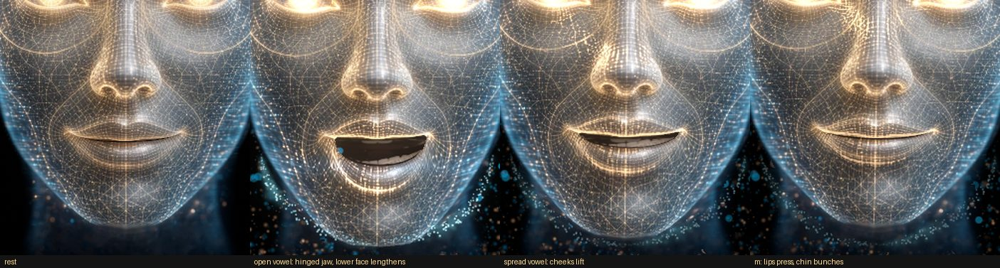
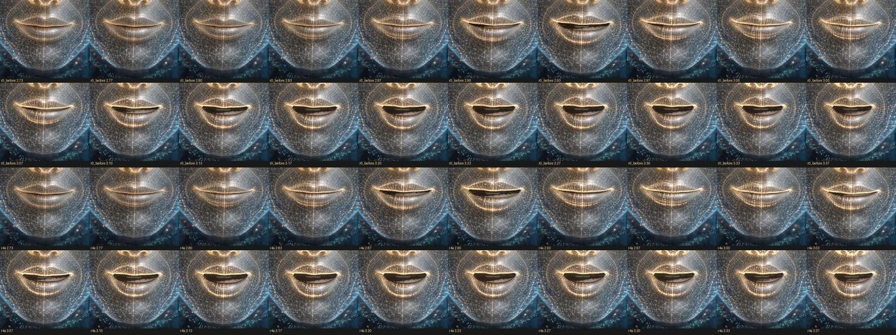

# Renderer app (chat, voice pipeline, UI)

The renderer is everything in the window around the hologram: the conversation state machine,
the speech pipeline, the chat panel and the settings. It talks to the Electron main process only
through `window.lawnmower` (contract §3); in a plain browser it uses a mock of the same API.

```
src/main.js              bootstrap: bridge → settings → speech/audio → UI → avatar → controller
src/bridge/              index.js (real bridge or mock), mock.js, mock-voice.js (in-page fake voice server)
src/app/                 controller.js      conversation state machine (contract §7)
                         sentence-chunker.js streaming text → speakable chunks
                         speech-text.js     Markdown → speech text
                         speech-queue.js    ordered TTS with limited parallel prefetch
                         permission.js      tool-call summaries, spoken prompts and cues
                         click-through.js   setIgnoreMouse decisions with hysteresis
                         gaze.js            cursor position (desktop-wide in Electron) → avatar.lookAt
                         settings-defaults.js renderer copy of the §4 defaults, getPath/patchFor
                         emitter.js         tiny event emitter
src/audio/               player.js (Web Audio queue + dry analyser), voicefx.js (+ voicefx-worklet.js: the
                         voice character on the audio thread), lipsync.js (drivers), articulation.js
                         (coarticulation model, speech plans), prosody.js (a clip's loudness and pitch →
                         speech events), g2p.js (text → phonemes), mic.js (+ mic-worklet.js), vad.js,
                         dsp.js (resampler), wav.js
src/speech/              voice-client.js (voice server §6), web-speech.js (browser voice), index.js (tts/stt routing)
src/ui/                  app-view.js, transcript.js, markdown.js, composer.js, permission-cards.js,
                         toasts.js, status.js, settings-drawer.js, accelerator.js, avatar-host.js, layout.js, dom.js
src/styles/app.css       the glass UI
```

## Conversation

`idle → listening → transcribing → thinking → speaking → idle`, mirrored on `body[data-state]`.

* Typed text enters at *thinking*. Sending while Claude is busy pre-empts the current reply
  (speech stops, the turn is interrupted, its partial text stays in the chat).
* Streamed text goes to the transcript (safe Markdown, re-rendered at most once per frame) and,
  when replies are spoken, through the sentence chunker → `toSpeechText` → the speech queue.
  The first chunk may be cut early at a clause (~40 characters) for a fast first sound; code
  blocks and tables are never spoken ("I've put the code in the chat.").
* Speech: the local voice server (Kokoro, with a viseme timeline) when it is running, otherwise
  the system's speech synthesis (Web Speech: the voice chosen in *Settings › Voice*, saved as
  `voice.systemVoice`, or the most natural English one; the list refreshes on `voiceschanged`),
  otherwise text only. Up to two sentences
  are synthesized ahead of the one playing. The local voice plays through the voice character
  (*Settings › Voice › Character*: Synth by default; `src/audio/voicefx.js` in an AudioWorklet, see
  [VOICE.md](VOICE.md#24-voice-character)); the lip-sync analyser taps the dry voice before it.
* Lip-sync each frame (see [Lip-sync](#lip-sync) below) → `avatar.setMouth` (jaw, wide, round,
  press, tuck, teeth, tongue), loudness → `avatar.setSpeechLevel`, prosody cues → `avatar.setProsody`,
  the local voice's pitch → `avatar.setIntonation`.
* Tool calls show as chips; if Claude goes straight to a tool the avatar says a short cue.
  Permission requests (agent mode) show a card with Allow/Deny and a spoken prompt. Nothing is
  ever approved automatically. Cards disappear when their turn ends or the CLI restarts.
* Voice input needs the local voice server (faster-whisper). Without it the mic button is
  disabled and its tooltip explains how to install it (*Set up local voice…*).
* First run: a missing or logged-out Claude CLI (main's `problem` event) shows a setup card over
  the avatar with the official install commands, Copy buttons and Retry (`src/ui/setup-cards.js`,
  `src/app/setup-help.js`); a voice setup that has to be run by hand shows its command the same way.
* Hands-free (setting): a VAD listens whenever the conversation is idle and pauses while the
  avatar thinks or speaks (half-duplex, so it never hears itself).
* After 10 idle minutes the avatar dozes (`sleep` state); any activity wakes it.

## Lip-sync

Every source ends in the same coarticulation model (`src/audio/articulation.js`): timed segments,
each an articulatory target on seven channels, blended by dominance functions (Cohen & Massaro):
the lips own m/b/p (press) and f/v (tuck), the jaw owns the vowels, rounding spreads ~120 ms ahead
into the consonants before an O / U (unless a spread vowel is in between), an h or a schwa takes
its neighbours' shape, and a closure is dominant enough that a 50 ms "m" still closes (press ≥ 0.8,
jaw ≤ 0.12: the lips do most of the closing, the jaw stays partly open between open vowels as it
does in speech; the director holds it at `JAW_BEHIND_SEAL` (0.4) while the lips close or are sealed
for a sound and lets it open for the next vowel as they part). A closure passed between two frames
is shown, and the director closes the jaw fast into it, so it also closes on screen at 30 fps. A
vowel between two closures shorter than 140 ms (`SHORT_VOWEL`: "Maybe my", "Bobby") narrows the two
lip gestures facing it and the second one's early approach, so the lips part for it.

| Source | Mouth |
|---|---|
| local voice (Kokoro) | the server's viseme timeline, re-timed on the clip's own sound and given per-vowel amounts from its formants (below), at the playback clock (smoothed, see [Motion](#motion)) + 26 ms visual lead for the lips where a closure's edge is an acoustic landmark (up to 58 ms where it is the timeline's own), 60 ms for the jaw (58 ms for both until the analysis is back; a rebuild while the clip plays crossfades over 80 ms), and the clip's own audio (the player's decoded buffer, or its WAV): the loudness envelope opens the jaw, sampled a moment ahead so a syllable's onset opens it as sharply as the sound starts; each vowel's jaw is scaled by its measured loudness and length (stressed syllables wider, reduced ones less); every sound varies a little (jaw ±8 %, spread, rounding), so repeated syllables are never identical; a phrase-final sound rests where the voice really stops (Kokoro holds a final "d" ~200 ms into the pause) |
| system voice (Web Speech) | the utterance's words → phonemes (`g2p.js`: a ~500-word exception dictionary incl. "Claude", NRL letter-to-sound rules, stress, numbers, acronyms) → a timed plan (stressed vowels long, closures ≥ 50 ms, phrase-final lengthening, rests at punctuation that ends a word; a mark inside a token — `package.json`, `github.com`, `10:30` — is read straight through, with a spoken "dot" between letters). Word-boundary events (`charIndex`) anchor each word; between them the plan runs at a speed learned from the boundaries (per utterance rate); an early boundary compresses the rest of the word, a late one holds the word's last sound (or waits at rest in a pause). Voices without boundary events play the whole plan from `onstart`, and the next utterance uses the tempo the last one turned out to have. A voice that has not reported its start after 0.6 s is assumed to have started; when its real `onstart` (or first boundary) comes later, the mouth re-anchors there instead of leading the voice, and no tempo is learned from the guess. |
| audio without visemes | RMS → jaw (noise gate), band ratios → spread / round, quiet hiss → teeth |

The plan also yields prosody cues (accents on the stressed syllables of content words, the last one
of a phrase strongest; phrase starts and ends with their punctuation; emphasis; friendliness),
which the director turns into small nods, phrase lifts, a brow raise and head tilt on questions,
blinks at phrase boundaries rather than mid-word, and a micro-smile after a friendly sentence. All
of it is pure and unit-tested (`tests/unit/app/{g2p,articulation,lipsync}.test.js`,
`tests/unit/avatar/{director-speech,mouth-rig}.test.js`).

**Listening to the voice (local voice).** The viseme timeline gives the categories (closed,
tucked, spread, rounded, open); the sound gives the timing and the amounts. Each clip's WAV is
analysed in a Web Worker (`src/audio/acoustics-worker.js` → `acoustics.js`; `acoustics-client.js`
falls back to the main thread only where there is no Worker, e.g. Node): every 5 ms its loudness,
a low band (< 400 Hz, the nasal murmur of m / n), a high band (> 3 kHz), voicing, and F1-F3 by LPC
(order 14 at ~12 kHz, Levinson-Durbin, roots warm-started; F1 within 2-3 % of a numpy reference
on the clips). The first 0.8 s are posted at once, the rest when done (~30 ms per 5 s of speech);
the controller starts it when the speech queue has synthesised a clip, before it plays.
`src/audio/fusion.js` (~0.25 ms per clip, under 1 ms; compiled at idle, with the segments built from it, one idle callback per step) then:

| Step | What it does |
|---|---|
| landmarks | phrase onsets (the first frame within 22 dB of the phrase's peak; a phrase-initial p at its burst, an m where its hum gives way to the vowel's upper formants); every m / b / p before a vowel ends at its release, whatever precedes it ("and Pam", "it back"): where the 0.8-5 kHz band rises out of the closure (the steepest rise, or the half-way point of a gradual one), and starts, after a vowel, where that band falls into it (`bandClosure`); before a consonant only the start; tucks (f v) between two vowels: the low band's dip. The neighbouring vowels keep part of their length ("probably") |
| time warp | a monotonic piecewise-linear warp of the timeline onto them (slopes 0.4-2.5, at most 90 ms; the two edges of one closure 0.2-6x), so the segments stay contiguous; an anchored edge is marked `exactStart` / `exactEnd` and gets a crisper lip edge and the lips' fused lead |
| amounts | per vowel: jaw from F1 (normalised to the voice's own range: the 12th-88th percentile of its vowels heard so far, from a prior by pitch), bounded per category (`JAW_RANGE`: U 0.04-0.3 … aa 0.3-0.95; an open vowel whose F1 reads as low as a close one's is a nasal pole, the ae of "Pam" before its m, and keeps its own opening); spread from F2 (front vowels); stress from loudness and length (×0.62-1.18; reduced front vowels lose spread and teeth); rounded vowels 82-100 % rounded |

Result on 36 real clips (af_heart, am_michael, bf_emma × six sentences × speeds 0.9 / 1.1), the
relief head's aperture at the centre of each vowel: r(aperture, F1) 0.34 → 0.66; open vs close
vowels 1.39x → 1.72x; stressed vs unstressed 1.45x → 1.61x. Before, the rounded vowels opened the
most (ɔ / o 58-61 px, ahead of the open vowels' 50 px); now ɑ 52, æ 45, ɔ / o 40, ɪ / i 24-26,
ʊ / u 21-24 px. On the 39 clips of the v0.4 review (each vowel's peak, the review's own LPC F1):
r(aperture, F1) 0.45 → 0.60 (689ec7c 0.62), open vs close vowels 1.67x → 1.87x (2.01x), stressed vs
unstressed 1.43x → 1.54x (1.58x); a rounded vowel's orifice is now narrower than the corners, so a
stressed oo / o reads round (width / height 4.5 / 2.9 on the rig, 689ec7c 7.0 / 4.2) instead of a
flat slit.


**Prosody from the voice itself (local voice).** For a clip with audio, `src/audio/prosody.js`
measures the loudness envelope (all at once, under a millisecond) and the pitch: YIN on a 1 kHz
low-passed copy decimated to ~6 kHz, octave slips folded back, ~25 µs per 10 ms frame, at most 20
frames per frame of the app, up to 0.8 s ahead of playback. A clip's analysis is prepared one step
per frame over its first frames (the WAV's base64, the WAV, then the envelope and the cue plan;
the first two are skipped when the player offers its decoded buffer), while the timeline-only
mouth plays its leading silence, and the analysis code is compiled once while the app is idle, so
no frame pays for it all. From the pitch and the timeline it derives the cues that replace the
text's for these clips:

| Cue | From the audio | The face |
|---|---|---|
| `inhale` | the silence before the first phrase and pauses ≥ 0.22 s, sized to the time left | nostrils flare, free lips part a little, the head and chest lift; breathing while speaking follows the pauses |
| `phrase-start` | each run of speech between rests ≥ 100 ms | a small lift; some phrases start with a glance away |
| `accent` | vowels whose pitch peak (re the speaker's usual pitch), rise, loudness and length beat the vowels within 0.3 s | a strong (nuclear) accent nods, a weaker one with a probability that grows with its strength (0.15 + 0.35 x), but no accent nods within 0.6-1.2 s (`NOD_REFRACTORY`, drawn) of the last nod; otherwise a turn / tilt beat, a brow flick, or nothing; nod sizes vary log-normally (±30 %), so the head never bobs once per stressed word (0.66 nods/s on 39 clips; v0.3 1.41) |
| `emphasis` | an accent ≥ 5 semitones above the usual pitch, rising ≥ 3 | brows lift, a firmer nod |
| `phrase-end` | where the voice stops, with its final fall / rise (semitones), the pause after it and the text's punctuation | a fall settles the head (final lowering); a question or a rising end lifts the brows and tilts the head; eye contact again; a blink when the pause is real |

The intonation (pitch in semitones re the speaker's usual pitch, the median of the clips heard)
also goes to `avatar.setIntonation`: the head follows it a little (~0.2° per semitone) and the
brows lift on peaks well above it. Blinks wait while the voice sounds.

**The face moving with the mouth.** The director derives `cheekRaise` (spread vowels, smiles;
less with a wide-open jaw), `chinRaise` (pressed lips, tucks, puckers: the mentalis) and
`nostrilFlare` (breaths) from the mouth; the relief head moves soft regions around its mesh's
MediaPipe landmark vertices with them (the cheek apples and the nasolabial folds beside them, the
chin boss, the nostril wings), fills rounded lips out, raises the upper lip with the jaw (~30 % of
the lower lip, so the upper incisors show on open vowels) and shapes the jaw drop like a hinge: the jaw's sides near the joints drop less than
the chin and lips, the chin travels 12 % farther (the lower face lengthens) and swings back. The
procedural head does the same in its vertex rig (its jaw already turns about the joint). All of it
is zero at rest: the rest render is unchanged.

**Conversational gaze.** While speaking, about half of the phrase starts bring a short glance
away (sideways, slightly up or down, 0.35-0.9 s) that ends by the phrase end; it is an offset on
top of `lookAt`, so the camera's eye contact and the cursor follow stay in charge.

**Expressiveness.** *Settings → Avatar → Expressiveness* (`avatar.expressiveness`, 0..2,
default 1) scales nods, lifts, tilts, brows, smiles, glances and the intonation; at 0 the head is
still while speaking. The face coupling is anatomy, so it keeps 40 % at 0.





Timing, measured end to end with `tools/visual/lipsync-align.mjs` (the rendered mouth of LipSync
+ director + the relief head's rig at 60 Hz vs the audio; negative = the mouth leads). A release
is where the 0.8-5 kHz band rises out of the closure (the tool's own zero-phase band-pass, so it
does not share the app's analysis); "689ec7c" is v0.4 before its review.

| | v0.3 | 689ec7c | v0.4 |
|---|---|---|---|
| lips part vs the release, after a vowel: median [IQR], share > 20 ms late, 39 review clips | -7.5 [-18, +2] ms, 6 % | -8.3 [-18, +9] ms, 17 % | -15.0 [-19, -8] ms, 4 % |
| ... after a consonant ("and Pam", "it back"), 39 review clips | -0.8 [-13, +12] ms, 18 % | +20.0 [-6, +30] ms, 51 % | -14.2 [-19, -10] ms, 4 % |
| ... after a consonant, the 36 clips / the 12 clips of v0.3 | -12 / +11 ms (0 / 43 %) | +8 / +23 ms (23 / 57 %) | -16 / -10 ms (0 / 17 %) |
| lips sealed (aperture < 1 px) vs the level dip, start / end, 36 clips | -32 / -15 ms | -30 / -20 ms | -32 / -18 ms |
| jaw opening after a pause vs the acoustic onset, 36 clips / the review's 15 at speed 0.9 | -53 / -46 ms | -43 / -63 ms | -38 / -63 ms |
| vowels of 60 ms or more that open the lips less than 5 px, 39 review clips | 2 / 621 | 3 / 621 | 0 / 621 |
| m / b / p sealed, 39 review clips (rig, the review's own landmarks) | 248 / 249 | 247 / 249 | 248 / 249 |

(39 review clips: af_heart, am_michael, bf_emma; five sentences at speeds 0.9 and 1.1 and three at
1.0, among them the Test lip-sync line. 36 clips: the same voices, six other sentences at 0.9 and
1.1. The releases still listed late are mostly a stop before an m, "made muffins": there the
band's steepest rise is the stop's burst into the m's murmur, not the lips.) The display adds one
to two frames of its own, so on screen the lips part within ~0-20 ms of the sound.
*Settings → Voice → Lip-sync timing* (`voice.lipSyncOffsetMs`, ±200 ms) shifts it for audio
devices with an unreported delay (Bluetooth); **Test lip-sync** says a line of m / b / p to judge it
by ([VOICE.md](VOICE.md#23-lip-sync-in-the-renderer)).

Kinematics (director springs `MOUTH_OMEGA`, `lipContact`): the lips approach a closure over
40-60 ms (the press spring rises at 48 rad/s from an open jaw, 64 from a nearly closed one, and
starts `LIP_CLOSE_EARLY` = 16 ms sooner than it falls) and meet at speed (contact at 55-80 % of
the spring's way, by how far apart they are) while closing for a sound; as soon as the target
falls (a release, or a short vowel between two closures) they show the spring as it is, so they
part as they move (70 rad/s). The jaw waits behind them (`JAW_BEHIND_SEAL`) and opens at 45 rad/s.
On the 39 review clips: the largest one-frame opening of the relief head's aperture 22.5 (v0.3) /
31.7 (689ec7c) → 20.3 px, the largest closing 47.8 / 32.1 → 30.3 px; the first frame after a seal
shows 7 % / 17 % → 12 % of the next peak; the per-movement peak speed closing / opening is
0.87 / 0.73 → 1.04 (the mouth neither pops open nor drifts shut).


Rendering: the relief head opens the lips as a lens that spans the corners where they are now
(wide for E; for O / U narrower still than the corners, `roundLensHw`: protruded lips meet beside
a small round orifice, an "oo" about half an "ah"'s width, 0.56 vs 0.92 of the mouth half width
on the review clips, an "o" 0.59): the commissures take only 40 % of the jaw drop and the
lower lip's share tapers toward them, so the corners stay closed and the opening's edges are smooth
curves that close into the seam without a kink over the last quarter of the way (no sharp dark tips
beside an O); the parted lips' inner edges roll into the mouth (a soft shadow, a thin moist highlight) and
the cavity darkens with depth. Its mouth region is refined to <= 6 px triangles at load (new
vertices on the baked edges, so the rest render is unchanged), which keeps those curves smooth at a
60 px jaw drop. The opening's outline follows the vowel: a slender almond for a small or rounded
opening, rounder-ended and flatter in the middle for an open or spread one (`uLens` z / w: the
lens profile's exponents for the upper and the lower lip), and the corners draw in a little as the
jaw drops (by its square), so a wide-open mouth is not a slot. The teeth belong to the jaw
(`heads/teeth.js`, shared by both heads): the upper incisors show with the parted lips (less
behind rounded ones), the lower teeth only once the jaw has dropped (or for an ee / s), never
behind pressed or tucked lips. It closes pressed lips over a slightly open jaw and thins them (the lip
texture is compressed toward the seam and the rest gap skipped; the shapes' parting fades with the
square of the press, so a press that is only half released still holds the lips together), brings a tucked lower lip up under
the incisors for f / v: the upper lip keeps half of the neighbouring vowel's lift and the opening
narrows by 20 %, so a narrow band of incisor crowns shows over the lower lip (the cavity shader
draws them from the mouth texture's incisor rows, found at load, `incisorBand`, at their own
height, `TUCK_CROWN_PX` under the upper lip, and lets them give way to the open mouth's teeth as
the jaw opens for the next vowel, so they never stretch into tall bars), not a dark slot;
it raises the upper lip for teeth (the incisors follow),
draws a dim tongue tip at the teeth, pulls the corners in for round and out for spread, and tilts
them slightly with `mouthAsym`. The procedural head does the same in its vertex rig and cavity
shader; the placeholder maps wide / round / press onto its mouth line.

Check it in the avatar harness: `/dev/avatar.html?fixedTime=1&vis=PP` (one viseme),
`?fixedTime=1&press=1`, `?fixedTime=1&tuck=1&jaw=0.08`, `?fixedTime=1&tongue=1&jaw=0.2`, and
`/dev/avatar.html?ui=0&caption=1&say=Hello!%20I'm%20Claude.&t=0.9`: a deterministic run of the real
system-voice path at 60 Hz (a scripted voice sends word boundaries at its own tempo with jitter;
`bounds=0` is a voice without boundaries; `rate`, `voiceTempo`, `jitter`, `latency`).
`window.__seek(t)` steps it; `node tools/visual/film.mjs` records the frames for a video
(see tools/visual/README.md). The local-voice path on real voice-server clips:
`/dev/avatar.html?ui=0&caption=1&clip=hello.json,maybe.json` (the `/tts` JSON with `audioB64`, or
`wav=<url>`) plays them back to back through the real LipSync, director and head;
`film.mjs --clip a.json,b.json --mp4 out.mp4` films it with the sound muxed in, and `expr=<0..2>`
sets the expressiveness.

## Motion

Everything the head does moves with continuous velocity and acceleration, at any frame rate:
nothing starts at full speed or stops dead, nothing steps between frames, and nothing repeats.

* **Primitives** (`src/avatar/motion.js`, pure): critically damped springs with an exact step (the
  same curve at 30, 60 or 144 Hz and through a dropped frame; they replace the one-pole lags,
  which start at full speed), an under-damped spring for a slight rebound, minimum-jerk kernels
  (pulses and envelopes that start and end at rest), the One Euro filter, 1/f ("pink") noise from
  several octaves of smooth noise at non-integer frequency ratios and random phases (it never
  repeats), Gaussian and log-normal draws.
* **Mouth**: every mouth channel follows the lip-sync target through its own spring, faster
  opening than closing (jaw ω 55 / 38 rad/s, press 110 / 55, round 33 / 24, ...). The lips seal an
  m / b / p on their own (the rigs bring the lower lip up over a jaw still open), so even a 50 ms
  closure seals on screen at 30 fps, and the heavier jaw follows them (ω 50 into a closure) instead
  of snapping shut within a frame. The chin (mentalis) follows the lips' target, in step with the
  closure.
* **Eyes** (`src/avatar/eyes.js`): saccades on the human main sequence (duration 21 + 2.2 ms per
  degree, a minimum-jerk profile with the peak speed mid-way: a 10 degree shift takes 43 ms),
  fixations that hold still between them (with 0.2-0.25 degree micro-saccades), smooth
  pursuit of a moving target (gain 0.9, up to 30 deg/s, ~100 ms behind) with catch-up saccades when
  it gets away, and a ~170 ms reaction time for targets it follows (cursor, camera). The head goes
  along with a target it follows (the cursor, the user's face): 38 % of the look, a spring a few
  hundred ms behind the eyes (t50 ~0.25 s, anticipating a moving target a little), never turning
  against them; with the avatar's own looks (and a glance away from the user) it takes a share of
  large shifts (20-30 %, more for big ones), starting late, and of small ones over seconds. The
  eyes counter-rotate as the head arrives (vestibulo-ocular reflex), so eye + head land on the
  target without overshoot. Gaze is composed in degrees (`GAZE_DEG`: 17 deg per gaze unit across, 12.8
  up and down; the relief iris slides 0.6 / 0.45 iris radii).
* **Blinks**: log-normal intervals (median 2.8 s idle, 4 s listening, 2.4 s thinking, 2.3 s
  speaking; never closer than 0.8 s), a fast close (60-80 ms) and a slower open (150-220 ms) with
  a brief hold, 20 % of them partial, 4 % doubled, a blink with most gaze shifts over 15 degrees, and the
  upper lid follows a downward gaze part of the way. They wait while the voice sounds.
* **Idle**: the head sways on 1/f noise (`pinkNoise` has unit rms: 1 deg yaw, 0.45 pitch, 0.26
  roll from 0.1 Hz up, ~0.8 deg rms yaw and ~0.5 deg/s over two minutes, plus a faint fast tremor),
  breathing has a wandering period and depth with an occasional sigh, the eyes wander in saccades
  between fixations, and the head follows the eyes only for large shifts.
* **Thinking**: each episode picks a side and a look (up 85 % of the time) and holds it, switching
  after an exponential time (mean 11 s, at least 5-8 s), with small looks around it.
* **States**: listening / thinking / speaking blend in through springs (head pitch t90 0.3-0.8 s)
  with a saccade to the new gaze, instead of a slow glide; starting to speak, the first look goes
  to the listener.
* **Speech**: nods are minimum-jerk pulses (0.17 s up, 0.31 s back, each a little different in
  size and speed, with a touch of yaw and roll; nods close together merge into the larger one, a
  running nod growing by a second pulse), phrase lifts and the breath before speaking are
  envelopes, and the intonation is soft-clamped.
* **Clocks**: the lip-sync runs inside the avatar's own frame (one loop: `avatar.setFrameHook`), so
  it never samples a different time than the face it drives. The playback time is smoothed by a
  phase-locked clock (`PlaybackClock` in `src/audio/lipsync.js`: it follows the player's reported
  time by at most 2 ms per frame, never runs backwards, stays within 12 ms ahead and re-syncs when
  30 ms off), which turns Windows' 10 ms AudioContext clock steps into smooth time; the player
  reads the output timestamp and a median of the output latency.
* **Camera and cursor**: the face centre goes through a One Euro filter and eye contact
  alternates log-normal contact phases with glances away ([CAMERA.md](CAMERA.md)); targets that
  arrive at 12 Hz (camera) or 30 Hz (cursor) are reconstructed between samples, so the eyes never
  see a staircase. A cursor outside the window is looked at along its direction at full strength
  (`src/app/gaze.js`), so a cursor coming in from across the screen never turns the eyes away
  from it first.
* **Eyes on the relief head**: the pack's landmark eye centres sit ~25 px off the painted irises
  (and their radii are ~20 % small), so the head locates the painted irises on the plate at load
  (the dark pupil inside the bright iris; `avatar.headInfo()` reports them), paints the plate over
  beneath them (the eye white beside the iris, its texture carried across) and moves each iris as a
  rigid disc inside the open eye: the lids, the lid lines and the eye's outline stay put and the
  pupil stays round. The disc shows only where the plate shows the eye's inside; the lid margins'
  glow lies over it (looking down, the pupil goes under the lower lid). A hidden part of a moving
  iris comes from its mirror image near the horizontal axis, blended into the same radius turned
  toward it farther out; the fill under the iris carries the eye white's and the lid glows'
  texture on (the lid margins along their own curve). The layer fades in over the first few % of
  travel, so at rest and just off it the plate itself shows (no pop as the gaze crosses zero). A
  pack whose plate cannot be read back keeps the old uv warp.
* Settled renders (`fixedTime`, tests) use the same closed-form rest poses as before.

Measured on deterministic 60 Hz traces of the harness (idle 300 s, thinking 60 s, five Kokoro
clips, the system voice, the camera and cursor replays; closures over 52 m / b / p in 18 real
Kokoro clips), before -> after:

| | before | after |
|---|---|---|
| head pitch kinks while speaking (Kokoro) | 1.75 /s | 0 /s |
| head pitch velocity power above 8 Hz (Kokoro) | 0.20 | 0.003 |
| nod: one-frame velocity step at onset / of the peak speed | 26 deg/s / 118 % | 3.6 deg/s / 30 % |
| idle saccades >= 1 deg: duration / peak speed (main sequence 28 ms / 98 deg/s) | 133 ms / 51 deg/s | 50 ms (3 frames) / 91 deg/s |
| idle gaze path (eye in head): fixation / drift / saccadic | 7 / 56 / 37 % | 31 / 17 / 53 % (the drift: counter-rotation against the head's sway; in the world the gaze holds still 96 % of the time) |
| idle head sway: yaw rms / mean speed over 2 min (3 seeds) | 0.80 deg / 0.55-0.63 deg/s, with 58-70 acceleration ticks /min | 0.78-0.86 deg / 0.49-0.55 deg/s, no ticks |
| blinks: shortest interval, amplitude spread, closed >= 90 %, doubles in 5 min | 0.3 s, 0, 83 ms, 12 | 0.8 s, 0.11, 33 ms, 0 |
| thinking: side switches, interval CV, gaze autocorrelation at the switch period | 17 /min, 0.18, 0.63 | 5 /min, 0.46, <= 0.19 |
| breathing autocorrelation at 4 s / 8 s | 0.99 / 0.97 | 0.86 / 0.61 |
| cursor flick: where eye + head land (world gaze vs the target) | 30 % past it | on it (the head takes ~40 %: 7.2-8.8 deg of a 20 deg flick, 11 of 28) |
| cursor follow (30 Hz sweep and circle, 5 seeds): head lag behind the cursor | 333 ms | 100-330 ms (median 200) |
| cursor sweep (30 Hz polls): consecutive-frame eye speed ratio (1 = smooth), power at 25-30 Hz | 1.52, 0.045 | 1.06, 0.004 |
| camera, slow sway: velocity power above 8 Hz (outside glances), kinks | 0.25-0.30, 0.66 /s | 0.002, 0.19 /s |
| camera, the face jumps: eye t90, peak speed | 600 ms, 18 deg/s | 250 ms, 68 deg/s |
| listening / thinking / speaking: head pitch t90 | 0.97 / 1.05 / 0.78 s | 0.32 / 0.80 / 0.45 s |
| m / b / p closures sealed (lips < 1 plate px), sealed time median / p10 | 51 of 52, 67 / 33 ms | 52 of 52, 67 / 50 ms |
| jaw one-frame velocity steps while speaking, jaw rms jerk | 43 /min, 5700 | 2 /min, 3000 |
| chin with the pressed lips: correlation, lag | 0.83, 29 ms (pumping: range 0.89) | 0.83, 31 ms (range 0.58) |
| Windows clock (10 ms steps): jaw error rms | 0.0107 | 0.0081 |

The mouth's timing against the audio is unchanged (m / b / p closures 35 ms ahead of the sound).

## Behaviour

On top of the motion, `src/avatar/behavior.js` gives the avatar a person's spontaneous repertoire
(the director calls it once a frame through one hook and adds what it returns: head offsets, a
posture, a gaze target of its own, face channels outside speech).

* **Scheduling.** Four tracks (gaze, head, face, breath), one gesture at a time on each. A free
  track waits an exponential (random, memoryless) time drawn from the total rate of the gestures
  that fit the situation now (the state, typing, the camera's view of the user, boredom), then
  starts one of them picked by its rate. Each kind has a refractory period (a pick inside it does
  not happen), and every instance draws its own durations, amplitudes and directions; a change of
  situation draws the pending waits again, the first one in a new state half as long. Start times
  are continuous (not frames) and every track, the posture, the activity state and the user's
  events draw from their own random stream: 60 and 144 Hz show the same gestures at the same
  moments for minutes on end. Nothing runs on a clock.
* **Calm and active stretches.** People move in bursts and are still in between: a hidden slow
  activity state alternates calm bouts (log-normal, median 40 s) with active ones (median 25 s)
  and scales the rates (x 0.17 calm, x 2.3 active in idle, the square root of that while
  listening or thinking; normalised to the kinds' mean). The gestures come in clusters (the Fano
  factor of their onsets in 30 s windows is 1.2-2.5 at the default liveliness; a regular process
  is < 1) with a calm half minute in most two-minute windows.
* **The user comes first.** The cursor (`lookAt(..., 'cursor')`), the camera's face, the user
  coming back into view or looking back cut the avatar's own looks short at once: the eyes are on
  the user within ~0.1 s, the head's share of the look goes back in 0.2-0.35 s, and no new look of
  its own starts for 1.2-2 s.
* **Kinematics.** Minimum-jerk envelopes and pulses that start and end at rest; a look into the
  room is a saccade of the eyes (the eye controller) with the head following in minimum-jerk steps
  (30-50 % of it, at least what keeps the eyes within 13 deg of straight ahead in the head;
  0.3-0.8 s, starting a moment after the eyes; the eyes counter-rotate, so the gaze holds still
  while the head arrives). Held tilts settle back a little and wander; the posture drifts through
  slow critically damped springs toward targets that change every 4-45 s (log-normal; longer in a
  calm bout) and wanders 0.2-0.3 deg around them. A gesture cut short fades out, so nothing steps.
* **Repertoire** (rates per minute at the default liveliness, before the activity scaling):

| Situation | Gestures |
|---|---|
| idle | looks around the room (4.5: 7-17 deg, the head along, sometimes scanning two or three points, then back), head tilts (2), posture shifts, lip presses (0.6) and purses, a swallow (0.35), a deep breath (0.45), a slow neck roll (0.15); brow flashes and smiles mostly for someone: 0.25 each at nobody, 1.2 and 1.0 while the camera sees you looking |
| the user back after a quiet minute (the cursor, typing) | a brow flash (half the time) and / or a smile (a third) 0.2-0.5 s later |
| idle for minutes, or the camera sees nobody | bored: longer looks away, slumping, sighs, now and then a yawn (a deep inhale with the brows up, a slow gape with no rounding of the lips while the eyes squeeze half shut and the head tips back 4-6 deg, a quicker close; fewer as one bored stretch goes on: x 0.35 per yawn, never within 4 min) |
| the user types | leans in, glances down at the chat now and then (16) |
| listening | leans in with a slight tilt, a nod at the pauses of the user's voice (half of them: a quarter of a second into a pause after 1.2 s or more of voice, from the mic meter's level), a few more at random (2), a brow "mm-hm" on 3 nods in 10, attentive tilts, a few brow flashes |
| thinking | the eyes settle on another spot of the averted region now and then (3, held ~1.4 s; the director's own small shifts pause meanwhile), a "hmm" (3: the head tilts, lips pressed, a squint), pressed or pursed lips, squints |
| speaking | the prosody leads: no gestures, only a slower posture drift, and an energy wave through the hologram on each emphasis |
| the camera sees you | engaged: fewer look-arounds (the eye contact of [CAMERA.md](CAMERA.md) leads), the head mirrors your tilt a little (28 %, a few hundred ms behind); when you look back at it after 3 s or more away, now and then (p 0.6 x smoothstep(3, 20 s) of the time away, at most once a minute) a smile with a brow flash, once its eyes are back on you |

* **Liveliness.** *Settings → Avatar → Liveliness* (`avatar.liveliness`, 0..2, default 1) scales
  the rates and (0.55 + 0.45 x liveliness) the sizes; 0 turns the behaviour off (so does
  `idleMotion` 0, and settled renders never have it: the golden poses are unchanged). It is a
  separate axis from *Expressiveness*, which scales the motion that comes with speech.
* **Inputs.** `avatar.setUser({ typing })` from the chat box (`src/main.js`), `{ present, looking,
  roll }` from the camera (`src/vision/index.js`; `roll` is the head tilt in the selfie view),
  `{ voice }` from the controller's tick while the mic listens (the meter's level, 0..1); a
  followed cursor counts as the user being around (no boredom).
* New AnimState channels: `lean`, `shiftX` (the posture: the heads scale the head about its pivot
  by up to 3 % and shift it by 2 % of the face height), `squint` (both lids narrow, the lower one
  rises; at 1 the eyes are about half shut), `pulse`. All 0 at rest.

Measured on deterministic 60 Hz traces of the director (5 seeds each: idle 600 s with the user
around, idle 600 s left alone, listening and thinking 180 s, typing 120 s, the camera 240 s with
the user looking away for 1.5-6.5 s every 6-26 s), before (87bb500, no behaviour layer) -> the
first behaviour layer -> now:

| | before | first layer | now |
|---|---|---|---|
| gestures per minute (idle / listening without a voice / thinking / typing / camera) | 0 | 8.2-9.6 / 9-11 / 11-14 / 8-13 / 5-7 | 5.3-6.6 / 1.1-4.1 / 5-11 / 5.5-11.5 / 1.3-3.8 |
| idle: Fano factor of the gesture onsets in 30 s windows (< 1: more regular than random) | - | 0.31-0.56 | 1.57-2.13 |
| idle: 2-minute windows with a calm half minute (no gesture starting) | - | 0-25 % | 62-100 % |
| idle: longest still stretch of the head per 10 min | 28-57 s | 11-14 s | 16-23 s (left alone: 15-43 s) |
| idle: time looking more than 5 deg away from the user | 1 % | 10-13 % | 7-10 % |
| idle: brow raises / smiles per minute (nobody watching) | 0 / 0 | 0.8-1.5 / 0.4-1.1 | 0.2-0.5 / 0.2-0.4 |
| idle: eyes pinned at their range (frames with eye-in-head at the clamp) | 0 % | 0.3-0.6 % | 0.02-0.19 % |
| the cursor appears during a look into the room: eyes on it (median / p90 / max, 40 trials) | 0.22 / 0.22 / 0.23 s (no such looks) | 0.22 / 1.13 / 3.70 s | 0.07 / 0.08 / 0.08 s |
| the user comes back (camera) during a bored look-away: eyes on them (max), acknowledged while still looking away | - | 12.2 s, 40 of 40 | 0.07 s, 0 of 28 |
| camera: acknowledgments per minute, brow raises / smiles per minute | 0, 0 / 0 | 2.5 (every 22 s, CV 0.24), 3-4.5 / 2.5-4.3 | 0.05, 0-1 / 0-0.75 |
| listening: brow raises per minute | 0 | 6.3-7.3 | 0.3-1.7 |
| thinking: saccades per minute, median fixation | 17-22, 1.9-3.1 s | 31-37, 1.05-1.23 s | 19-24, 1.9-2.1 s |
| bored: yawns per 10 min (5 x 10 min left alone), interval CV | 0 | 2.8, 0.17 (a clock at its 110 s refractory) | 1.8, at least 240 s apart and rarer as the boredom goes on |
| 60 vs 144 Hz, 240 s (idle seeds 1-3, listening and thinking 1-2): the same gestures | - | 5 of 7 runs | 7 of 7 (start times within 0.03 s) |
| head yaw / roll rms (idle with the user around) | 1.0 / 0.25 deg | 2.0-2.4 / 1.6-1.9 deg | 1.9-2.3 / 1.4-1.8 deg |
| blinks per minute (idle) | 16-18 | 18-20 | 17-20 |

(The CPU cost of the behaviour layer is ~0.03-0.05 ms per frame.)

In the harness: `/dev/avatar.html?sim=1&state=thinking&t=20` steps a live run to 20 s
(`window.__seek(t)`; `window.__avatar.setUser(...)` in between), `life=<0..2>` sets the
liveliness.

## The hologram: depth, light, glow

* **Light that turns with the head** (relief): the relief is a height field, so it has real surface
  normals; a key light from the upper left front lights it relative to the rest pose (whose light
  is baked into the plate): turning toward the light brightens that side, away from it darkens it,
  a tight cyan-white glint slides over the brow, the nose and the cheekbones, and the edges
  turning away catch more cyan rim light (never whitened: over a white desktop a white edge melts
  into it; and only on the solid face and cranium, not on the fringe, the ears or the glow around
  them, where a rim reads as a haze around the head). At rest the key light changes nothing.
* **Crisper and brighter:** the gold lines and the eyes are sharpened (an unsharp mask against a
  coarser mip level), the rest of the plate barely and the fine wire grid not at all (its
  sub-pixel lines would crawl and sparkle as the head moves); the eyes' bright parts and the lit
  gold lines glow, the eyes through a soft knee that keeps their hue (the iris centre glows amber,
  never white-hot, and its fibres survive); the eyes' glow breathes and rises a little with the
  voice; faint scan lines (a 3 CSS px pitch at any display scale) drift slowly; an emphasis sends
  an energy front out from the brow over the lines and the grid (AnimState `pulse`).
* **Depth:** the aura turns and shifts with the head about its pivot, a few frames behind it
  (springs), each layer at its own depth: the face, the halo, the ribbons and the far field slide
  against each other as the head moves (parallax).
* **A clear silhouette over any desktop:** the relief's face and cranium are glass that occludes
  the desktop (`opacity` 0.94; its baked occlusion mask, without the old glow gate), so a busy
  desktop no longer shows through the forehead; the bloom chain also carries the scene's coverage,
  and the final pass lays a thin dark outline just outside the head with it (up to 30 %, gone
  within ~8 CSS px; its base mip level is picked from the pixel ratio and the bloom scale, so it is
  as wide at any display scale and on every tier), which separates it from a bright or busy
  desktop and is invisible over a dark one. The ears, the fringe and the dissolving neck stay pure
  light.
* **Output:** *High* renders at the display's resolution up to 2x with 4x MSAA, *Medium* up to
  1.5x with 2x MSAA, *Low* at 1x without either (the relief's edges are soft in its own texture;
  FXAA, tried, smeared the fine grid and the irises and cost a fifth more); the plates are
  mipmapped and anisotropically filtered.
* **Automatic quality** (`QualityGovernor`, src/avatar/quality.js): when the frame rate stays
  below ~50 fps for 3 s (0.85 x the refresh rate on a slower display, never below 42.5 fps; the
  refresh is the frame loop's shortest frame interval lately), it first renders that tier at
  0.75 x its pixel ratio cap (when that lowers it), then steps down to the next tier, one step at a
  time with a warm-up after each. (It used to act only below 24 fps, so 25-50 fps on High was
  never corrected.)
* **Projector light** (optional, *Settings → Avatar → Projector light*, `avatar.projector`): a small
  bright emitter at the bottom of the view and a faint cone of light widening from it into the
  neck (brighter edges, slow beams, scan lines running up), fading out before the face; it
  brightens with the avatar's energy and dims in sleep. Off by default.


Measured on stills of the harness (392 x 584 CSS px, SwiftShader, fixedTime 1) over black and
the `bg=dark|bright|busy` desktops, before (87bb500) -> the first pass -> now:

| | before | first pass | now |
|---|---|---|---|
| a busy / bright desktop showing through the face (mean difference to the same frame over black, 0-255) | 18.2 / 28.2 | 8.8 / 13.5 | 8.9 / 13.5 |
| the edge's luminance step over a bright desktop, at rest / head turned 0.3 rad | 0.337 / 0.337 | 0.302 / 0.210 | 0.350 / 0.303 |
| ... over a busy / a dark desktop | 0.165 / 0.134 | 0.161 / 0.138 | 0.164 / 0.146 |
| light 1-12 px outside the head over black, relative to the face (glow spill) | 0.246 | 0.317 | 0.242 |
| the dark outline's alpha 4-6 / 8-10 / 24-26 CSS px out (DPR 1; DPR 2 within 0.01) | 0.12 / 0.10 / 0.04 | 0.30 / 0.23 / 0.09 | 0.18 / 0.10 / 0.04 |
| crispness inside the face (mean abs. Laplacian), High / Low | 0.167 / 0.168 | 0.248 / 0.123 | 0.191 / 0.177 |
| grid crawl: frame-to-frame high-pass change on a 0.003 rad yaw sweep, DPR 1 / 2 (relative to the detail) | 0.027 / 0.035 (0.68 / 0.77) | 0.040 / 0.049 (0.70 / 0.83) | 0.031 / 0.039 (0.69 / 0.78) |
| eye pixels above L 0.98 (22 px around the pupils), rest / speaking (speech 0.85, energy 0.9) | 0.2 % / 39 % | 16 % / 48 % | 0.3 % / 30 % |
| idle shimmer: frame-to-frame change in the face at liveliness 0 (0-255) | 2.97 | 4.21 | 3.33 |

Render cost, SwiftShader (software rendering on the CPU: a proxy for the GPU's fragment work, and a
noisy one), ms per frame of the idle avatar, the three builds interleaved block by block (median
of 6 blocks of 15 frames; DPR 3 renders at High's cap):

| Tier, DPR | before | first pass | now |
|---|---|---|---|
| High, 1 (MSAA 4x) | 197 | 283 | 238 |
| High, 2 (784 x 1168) | 575 | 691 | 672 |
| High, 3 | 544 (784 x 1168) | 1289 (1176 x 1752) | 647 (784 x 1168) |
| Medium, 1 (MSAA 2x) | 184 | 225 | 226 |
| Low, 1 | 84-86 | 110-124 | 88 |

The projector light adds nothing measurable; the draw calls are unchanged (13 / 11 / 9). The CPU
side of a frame (director, behaviour, particles' springs) is 0.04-0.07 ms. Not measured on real
GPUs here: on a desktop GPU this is far inside the 16.7 ms frame; a weak integrated GPU gets the
automatic quality's steps (above) and Low, which costs what it did before the light.

The rest pose moves a little from the reference frame by design (the same pose and shape, but
brighter lines and eyes, the rim, the sharpening): `compare.py score` against
`preview/neutral.jpg` (masked, 784 x 1168), before -> the first pass -> now: SSIM 0.517 -> 0.465
-> 0.507, SSIM (2 px blur) 0.925 -> 0.896 -> 0.917, PSNR 21.3 -> 19.6 -> 20.6 dB, MAE 14.0 -> 18.0
-> 15.0. The settled poses themselves (fixedTime and settle renders, the director tests) are
unchanged: the behaviour layer is off in them.

## Using it

| Input | Action |
|---|---|
| Enter / Shift+Enter | send / new line (↑ recalls the last messages) |
| hold **Space** (focus not in a text field) | push-to-talk; release to send |
| mic button | click: listen until you stop talking (click again to stop); hold: push-to-talk |
| **Esc** | close settings · cancel listening · stop speaking · otherwise stop the reply |
| send button while busy | becomes Stop |
| global hotkeys (Settings › Shortcuts) | talk / interrupt, stop speaking, show/hide chat |
| drag the head (or the status line) | move the window (snaps to screen edges and corners) |

The window is the 2:3 avatar area plus a chat strip below it. With the chat panel on, the panel
fills the strip; with it off (minimal mode) the panel drops down from under the chin while
something happens or the pointer is near, and folds away when idle. It never covers the face,
and the window keeps its size when the mode changes; the folded strip is transparent. With click-through on (Windows/macOS), clicks on transparent
pixels reach the desktop; the head, the panel and cards stay clickable.

## Browser preview (no Electron)

`npm run build && npm run preview`, or Vite dev, then open `index.html?mock=1`:

| URL parameter | Effect |
|---|---|
| `mock=1` | use the mock bridge (also automatic when `window.lawnmower` is missing) |
| `voice=fake` | in-page fake voice server: spoken replies with visemes, canned speech recognition |
| `voice=http://127.0.0.1:PORT&voiceToken=T` | a real voice server, e.g. `LAWNMOWER_VOICE_TOKEN=T python -m lawnmower_voice --fake --port PORT` (from `voice/`; CORS allows 127.0.0.1:5173/4173) |
| `mockDelay=ms`, `mockFirst=ms` | streaming speed of the mock |
| `settings={"avatar":{"quality":"low"}}` | initial settings patch |
| `clickThrough=1` | exercise click-through decisions (recorded in `__app.bridge.__mock.calls`) |
| `claude=missing` / `claude=auth` | first run without a Claude CLI / with a CLI that is not logged in: the setup cards; `claudeRetries=N` makes the first N Retry clicks fail |
| `layout=electron` | use the desktop window's layout rule |
| `bg=desk` | a colourful backdrop to judge transparency |

The mock streams canned replies: a greeting ("hello"), a code example ("code"), a Markdown
showcase ("markdown"), a long answer ("story", "explain"), a Bash tool call that waits for the
permission card ("run", "tool"), a failure ("simulate error"), otherwise an echo.
`window.__app` exposes the controller, view, avatar and bridge for debugging.

## Tests

* `npx vitest run tests/unit/app` — chunker, speech text, controller (fake bridge/player/TTS/STT/mic),
  speech queue, G2P, coarticulation and speech plans, lip-sync drivers (incl. Web Speech → player →
  lip-sync with fake timers, with and without boundary events), audio prosody (pitch on tones and
  glides, voiced / unvoiced, accents, final falls and rises, breaths) and the jaw from a clip's
  loudness, VAD/resampler/WAV, mic (fake
  getUserMedia), player (fake Web Audio), Markdown parser/renderer, mock bridge, voice client,
  Web Speech, permissions, UI logic.
* `npx vitest run tests/unit/avatar` — the motion primitives and the eye controller
  (`motion.test.js`: springs exact at any step, main-sequence saccades, pursuit, head share,
  pinkNoise's unit rms), the director's motion (`director-motion.test.js`: continuous velocity, the
  same motion at 60 and 144 Hz, blink statistics, thinking episodes, nods and nods that grow, the
  head going along with a cursor sweep and flick but not with a glance, the idle sway's size,
  eye contact as speech starts, the settled poses unchanged), the behaviour layer
  (`behavior.test.js`: the idle repertoire, no clock and no autocorrelation peak over minutes,
  refractory periods, smooth heads at 60 and 144 Hz, boredom, listening / thinking / typing /
  speaking / camera, liveliness), the hologram's light and depth (`pop.test.js`: the relief's
  normals, the aura turning with the head, tiers, the projector), the relief head's mouth-mesh
  refinement and iris layer (`relief-refine.test.js`, `relief-iris.test.js`: the open map, the
  fill along an arched lid) and the rigs. `tests/unit/app/lipsync-real.test.js` keeps every
  m / b / p of the real Kokoro fixture sealed on the relief rig for >= 50 ms, the chin with it.
* `npx playwright test` — the built app in Chromium (SwiftShader) with the mock bridge: boot +
  hologram pixels, streaming states, safe Markdown + copy, permission cards, interrupt, error
  toasts, settings drawer + renderer switch, minimal mode, hotkeys, click-through, spoken replies
  with lip-sync (`voice=fake`), push-to-talk through Chromium's fake microphone, and the full loop
  against the real Python voice server in `--fake` mode (skipped when Python/FastAPI are missing),
  and the relief head's irises (located on the plate; no change at all as the gaze leaves zero,
  `avatar-eyes.spec.js`). Screenshots go to `$LM_SHOTS_DIR` (default `test-results/screenshots`).
